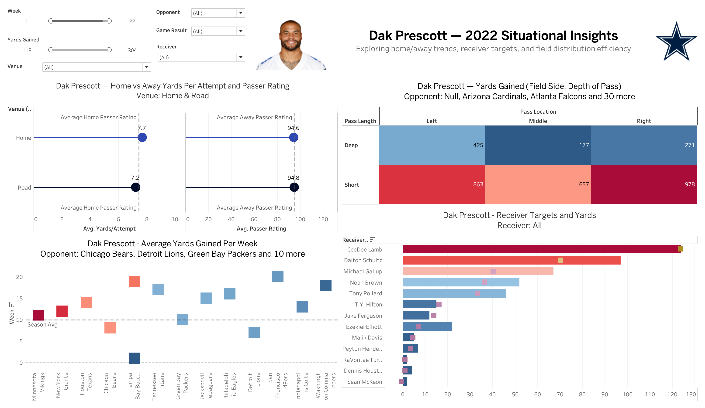
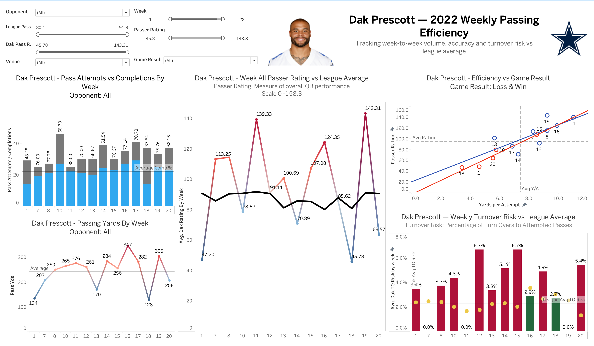

# Dak Prescott — 2022 Passing Performance Analysis (Tableau)
> Interactive Tableau analysis evaluating quarterback efficiency, risk, and situational performance using official NFL play-by-play data.

## Overview
This project analyzes **Dak Prescott’s 2022 NFL season** using official **NFL box score and play-by-play data** to evaluate passing efficiency, situational performance, spatial tendencies, and weekly consistency.

The Tableau dashboards enable interactive exploration across **week, opponent, venue (home/away), game result, receiver, and efficiency thresholds**, allowing users to understand how performance varies by context and decision-making conditions.

---

## Data Sources
- Official **NFL Box Score Statistics (2022–23 Season)**
- Official **NFL Play-by-Play Data (2022–23 Season)**

All metrics shown are derived directly from league-reported game data.

---

## Project Objectives
- Measure **weekly passing efficiency** relative to league averages
- Compare **home vs away performance**
- Analyze **passing distribution** by field side and depth
- Evaluate **receiver usage and productivity**
- Assess **turnover risk** in relation to volume and efficiency
- Connect efficiency metrics to **game outcomes**

---

## Repository Contents
- `Dak-Prescott-Performance.twbx` — Tableau packaged workbook (dashboards + data)
- `dashboard_overview.png` — situational, spatial, and receiver-level analysis
- `weekly_efficiency.png` — week-by-week efficiency, volume, and risk analysis
- `README.md` — project documentation

---
## Key Takeaways
- Passing efficiency is meaningfully higher in home games, driven by increased yards per attempt and passer rating
- High-volume passing weeks do not always correlate with higher efficiency, highlighting the importance of context-adjusted metrics
- Primary receivers account for a disproportionate share of yards and targets, indicating concentrated offensive dependency
- Turnover risk remains close to league average even during high-efficiency games, suggesting controlled decision-making

---

## Tools & Skills Demonstrated
- Tableau Dashboard Design & Interactivity
- Sports Analytics & Performance Evaluation
- KPI Development (Passer Rating, Yards/Attempt, Turnover Risk)
- Data Storytelling & Visual Communication
- Comparative Benchmarking vs League Averages

---

## Dashboard Preview

### Situational & Spatial Insights

### Weekly Passing Efficiency

---

## Dashboard 1: Situational & Spatial Insights
This dashboard focuses on **where, how, and to whom** Dak Prescott generated passing production.

### Key Views & Metrics
- **Home vs Away Efficiency**
  - Average yards per attempt
  - Average passer rating
- **Passing Distribution**
  - Yards gained by **field side** (left, middle, right)
  - Yards gained by **pass depth** (short vs deep)
- **Receiver Production**
  - Total yards and targets by receiver
- **Opponent & Weekly Context**
  - Average yards gained by opponent and week

### Key Insights
- Prescott demonstrates **stronger efficiency metrics at home**, with higher average yards per attempt and passer rating relative to road games
- The majority of passing yards come from **short and intermediate throws**, with directional tendencies shifting based on opponent
- Receiver production is **concentrated among primary targets**, with clear separation between top receivers and rotational contributors
- Performance varies meaningfully by opponent, highlighting the importance of contextual evaluation beyond season averages

---

## Dashboard 2: Weekly Passing Efficiency & Risk
This dashboard evaluates **week-to-week performance consistency**, comparing Prescott’s output to league benchmarks.

### Key Views & Metrics
- **Pass Attempts vs Completions by Week**
- **Weekly Passer Rating vs League Average**
- **Efficiency vs Game Result**
  - Passer rating vs yards per attempt
  - Win/loss segmentation
- **Turnover Risk Analysis**
  - Turnover rate by week
  - Comparison to league-average turnover risk

### Key Insights
- Prescott’s passer rating frequently **exceeds league average**, with several peak-efficiency performances
- Higher passing volume does not always correspond to higher efficiency, reinforcing the importance of **yards per attempt and decision quality**
- Games with higher efficiency metrics align more closely with **wins**, while lower efficiency weeks show greater variability
- Turnover risk generally remains near league norms, even during higher-volume passing weeks, indicating **controlled risk exposure**

---

## Analytical Value
This project demonstrates how **sports performance data** can be transformed into **decision-ready insights** by:
- Benchmarking individual performance against league averages
- Integrating spatial, situational, and temporal dimensions
- Using interactive filters to support exploratory analysis and storytelling

---

## How to View the Dashboard
1. Download `Dak-Prescott-Performance.twbx`
2. Open using **Tableau Desktop**
   - Tableau Public users may open and re-publish the workbook

---

## Author
**Carlos Padilla**  
M.S. in Business Analytics Candidate  
University of Notre Dame

---

## Potential Enhancements
- Incorporate advanced efficiency metrics (e.g., EPA, CPOE)
- Adjust performance for defensive strength
- Extend analysis across multiple seasons
- Publish an interactive version on Tableau Public
